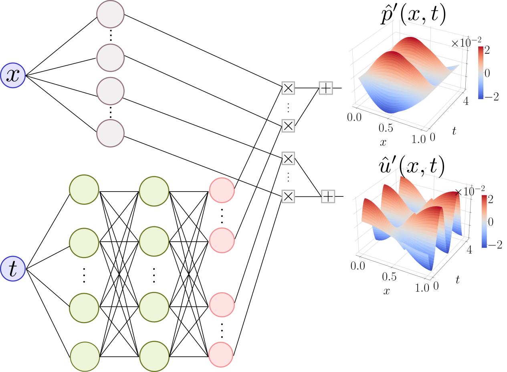

# HCTA: Hard-constrained neural networks for thermoacoustics

Repository for [<em>Hard-constrained neural networks for modelling nonlinear acoustics</em>, Phys. Rev. Fluids 8, 103201, D.E. Ozan and L. Magri (2023).](https://arxiv.org/abs/2305.15511)

In this work, we model acoustic and thermoacoustic pressure and velocity oscillations from synthetic data. The synthetic data captures the rich nonlinear behaviour of thermoacoustic oscillations observed in propulsion and power generation. We develop acoustic neural networks, in which prior physical knowledge is embedded as both soft and hard constraints. We predict and extrapolate in time thermoacoustic oscillations, reconstruct pressure and velocity over the entire domain from pressure sensors only, and obtain a model that is robust to noise and generalizable to unseen scenarios.
<p align="center">
  
</p>

For a step by step tutorial of the code, see our repository for [Newton Institute Workshop 2023](https://github.com/MagriLab/NewtonWorkshop2023/tree/main/thermoacoustic_neural_networks).

## Installation

HCTA can be installed as a package along with the dependencies required to run the project:
```bash
$ pip install -e ".[dev]"
```
(For development purposes, `pre-commit` can be installed.)

## Generate or download data
In our paper, we handle two test cases. 
The data for the twin experiments with Rijke tube (Sec. V) can be generated by running (for example for beta = 5.7):
```bash
$ python3 -m hcta.rijke_galerkin.generate --data_path data/rijke_kings_beta_5_7_tau_0_2.h5 --N_x 13 --beta 5.7 --x_f 0.2 --tau 0.2
```
Replace beta with 5.7, 6.0, 7.0 to generate the data for limit-cycle, quasiperiodic, chaotic cases, respectively. 
<br/>
For fine grid, 
```bash
$ python3 -m hcta.rijke_galerkin.generate --data_path data/rijke_kings_beta_5_7_tau_0_2_fine.h5 --N_x 49 --beta 5.7 --x_f 0.2 --tau 0.2
```
For long term simulation,
```bash
$ python3 -m hcta.rijke_galerkin.generate --data_path data/rijke_kings_beta_5_7_tau_0_2_long.h5 --N_x 13 --beta 5.7 --x_f 0.2 --tau 0.2 --simulation_time 1000
```

The higher-fidelity data (Sec. VI) was generated using the code from [[1]](https://github.com/xoeg/Flame-Transfer-Function-Tutorial) and [[2]](https://github.com/MagriLab/Real-time-TA-DA). 
<br/>
We provide all of the datasets [here](https://zenodo.org/records/10021355), you can download and save them in `data` folder.

## Run experiment. 
An experiment can be performed by running:
```bash
$ python3 -m hcta.experiment --config_path src/configs/config.yml
```
Create and edit a config file to change the experiment parameters. Default is `src/configs/config.yml`. 
<br/>
Optionally, the experiments can be uploaded to [Weights and Biases](wandb.ai)

## Plot figures
Figures in the paper can be reproduced by running the relevant scripts in `figures` folder.
<br/>
We provide the model data (configs, weights etc.) for these figures in `figure_data` folder.
<br/>
For Figures 13 and 14, since these figures were the results of sweeps with many models, we did not provide the model data to plot the figures. However, these sweeps can be run again if desired 
by running `robustness_sensor.py` and `robustness_noise.py` by configuring the relevant config files, and plotted using the relevant figure scripts.

